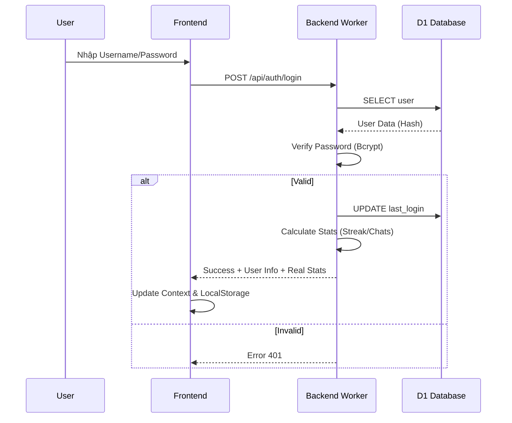
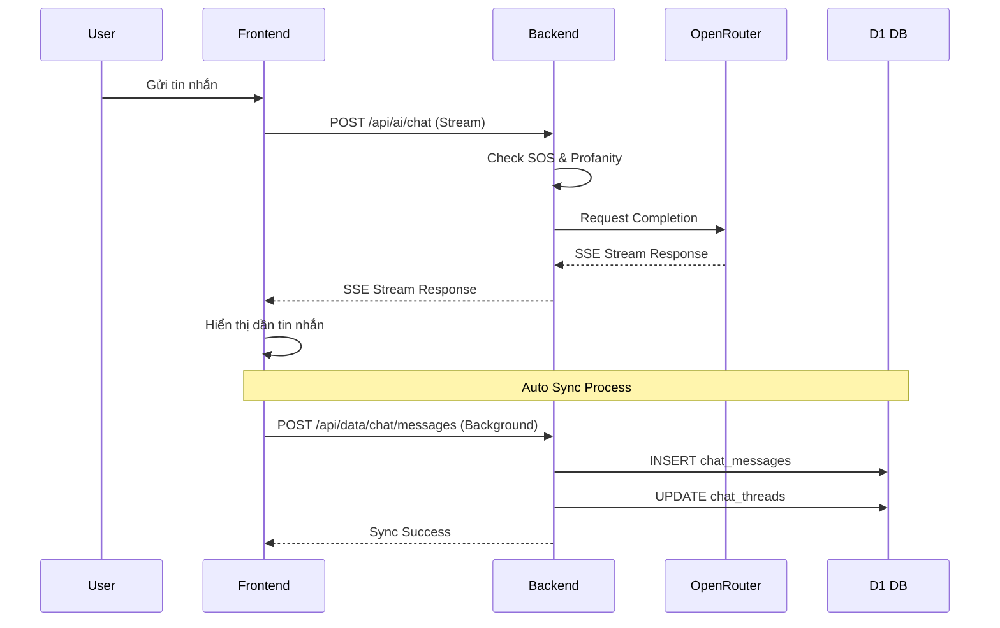

<p align="center">
  
</p>

<h1 align="center">Bạn Đồng Hành (The Companion)</h1>

<p align="center">
  <strong>Nền tảng hỗ trợ sức khỏe tinh thần toàn diện dành cho học sinh Việt Nam 🇻🇳</strong>
</p>

<p align="center">
  <a href="https://bandonghanh.pages.dev">🌐 Demo Trực Tuyến</a> |
  <a href="#-tính-năng-nổi-bật">✨ Tính Năng</a> |
  <a href="#-kiến-trúc--luồng-hoạt-động">🏗 Kiến Trúc</a> |
  <a href="#-hướng-dẫn-cài-đặt">📦 Cài Đặt</a>
</p>

---

## 📌 Giới thiệu

**Bạn Đồng Hành** là một ứng dụng web Progressive Web App (PWA) được thiết kế đặc biệt cho lứa tuổi vị thành niên (12-18 tuổi). Dự án kết hợp công nghệ AI tiên tiến với các phương pháp tâm lý học tích cực để tạo ra một không gian an toàn, nơi các bạn trẻ có thể chia sẻ, học hỏi và chữa lành.

### Sứ mệnh cốt lõi

> "Không ai phải lớn lên một mình."

| Trụ cột | Mô tả |
|---------|-------|
| 🧠 **Thấu hiểu** | AI Mentor lắng nghe và thấu cảm không phán xét |
| ❤️ **Chữa lành** | Các bài tập thở, thiền và viết nhật ký biết ơn |
| 🛡️ **Bảo vệ** | Hệ thống phát hiện sớm dấu hiệu rủi ro (SOS) |
| 🌱 **Phát triển** | Thư viện kiến thức kỹ năng sống và hướng nghiệp |

---

## ✨ Tính năng nổi bật

### 1. 🤖 AI Mentor (Trợ lý ảo thông minh)
- **Chat & Voice:** Trò chuyện bằng văn bản hoặc giọng nói tiếng Việt tự nhiên.
- **Real-time Context:** AI nhớ ngữ cảnh hội thoại và cá nhân hóa phản hồi.
- **Safety First:** Cơ chế kiểm duyệt nội dung độc hại và phát hiện SOS đa tầng.

### 2. 📊 Real-time Dashboard
- **Streak:** Theo dõi chuỗi ngày điểm danh liên tục.
- **Chat Stats:** Thống kê số lượng tương tác thực tế với AI.
- **Biểu đồ cảm xúc:** Theo dõi biến động tâm trạng theo tuần.

### 3. 🧠 Góc Kiến Thức (Knowledge Hub)
- **Thư viện bài viết:** 15+ chủ đề từ tâm lý, tình yêu tuổi học trò đến hướng nghiệp (Ikigai) và tài chính cá nhân.
- **Responsive UI:** Trải nghiệm đọc mượt mà trên mọi thiết bị với chế độ Focus Mode.

### 4. 🧘 Wellness Center (Trung tâm an yên)
- **Bài tập thở:** 4-7-8, Box Breathing với hướng dẫn visual sinh động.
- **Lọ Biết Ơn:** Ghi lại những điều tích cực nhỏ bé mỗi ngày.
- **Góc Nhỏ:** Đồng hồ Pomodoro và âm thanh thiên nhiên giúp tập trung.

### 5. 🎮 Game Therapy (Trị liệu qua trò chơi)
- **Color Match:** Rèn luyện phản xạ và nhận diện màu sắc.
- **Bubble Pop:** Xả stress bằng cách đập bong bóng ảo.
- **Memory Flip:** Luyện trí nhớ ngắn hạn.

---

## 🏗 Kiến trúc & Luồng hoạt động

### System Architecture

```mermaid
graph TD
    User[User Device 📱/💻] -->|HTTPS| Cloudflare[Cloudflare Edge Network ☁️]
    
    subgraph Frontend [React SPA]
        UI[User Interface]
        State[Global State (Context)]
        Cache[Local Storage]
    end
    
    subgraph Backend [Cloudflare Workers]
        Router[API Router]
        Auth[Auth Service]
        AI[AI Proxy Service]
        Risk[Risk Engine (SOS)]
        Data[Data Service]
    end
    
    subgraph Database [Cloudflare D1]
        DB[(SQLite DB)]
    end
    
    subgraph External_APIs [External Services]
        OpenRouter[OpenRouter AI API]
        DDG[DuckDuckGo Search]
    end
    
    Cloudflare --> Frontend
    Cloudflare --> Backend
    
    UI <--> State
    State <--> Router
    
    Router --> Auth
    Router --> AI
    Router --> Data
    
    Auth <--> DB
    Data <--> DB
    
    AI --> Risk
    AI --> DDG
    AI --> OpenRouter
```

### Authentication Flow



### AI Chat Flow (with Data Sync)



---

## 🛠 Công nghệ sử dụng

| Lĩnh vực | Công nghệ |
|----------|-----------|
| **Frontend Core** | React 18, Vite 6 |
| **Styling** | Tailwind CSS 4, Framer Motion (Animations) |
| **State Management** | React Context API, Custom Hooks |
| **Markdown & Math** | React Markdown, KaTeX, Remark/Rehype |
| **Backend** | Cloudflare Workers (Serverless) |
| **Database** | Cloudflare D1 (Distributed SQLite) |
| **AI Integration** | OpenRouter API (Gemini/Mistral/Llama) |
| **Search Engine** | DuckDuckGo Instant Answer API |
| **Deployment** | Cloudflare Pages |

---

## 📁 Cấu trúc thư mục

```
duancuahocsinh/
├── frontend/                 # React Application
│   ├── src/
│   │   ├── components/       # Reusable UI Blocks
│   │   │   ├── layout/       # Sidebar, Header, etc.
│   │   │   ├── ui/           # Buttons, Cards, Inputs
│   │   │   └── games/        # Game Components
│   │   ├── pages/            # Main Screens (Dashboard, Chat, KnowledgeHub...)
│   │   ├── services/         # API Integration Logic
│   │   ├── hooks/            # Custom Hooks (useAI, useAuth)
│   │   ├── data/             # Static Contents (Articles, Quotes)
│   │   └── utils/            # Helpers
│   └── public/               # Assets
│
├── backend/                  # Serverless Backend
│   ├── workers/
│   │   ├── router.js         # API Entry Point
│   │   ├── auth.js           # Login/Register Logic
│   │   ├── ai-proxy.js       # AI Handling & Prompt Engineering
│   │   ├── data-api.js       # CRUD Operations
│   │   └── schema.sql        # Database Structure
│   └── wrangler.toml         # Cloudflare Config
│
└── README.md                 # Project Documentation
```

---

## 📦 Hướng dẫn cài đặt

### Yêu cầu tiên quyết
- Node.js 18.x trở lên
- Tài khoản Cloudflare (để deploy backend)

### 1. Setup Backend (Cloudflare Workers)

```bash
cd backend
npm install

# Login vào Cloudflare
npx wrangler login

# Tạo database D1
npx wrangler d1 create ban_dong_hanh_db

# Chạy migration để tạo bảng
npx wrangler d1 execute ban_dong_hanh_db --local --file=./workers/schema.sql

# Start local server
npm run dev
```

### 2. Setup Frontend

```bash
cd frontend
npm install

# Tạo file .env.local
echo "VITE_API_URL=http://localhost:8787" > .env.local

# Start dev server
npm run dev
```

Truy cập `http://localhost:5173` để trải nghiệm ứng dụng!

---

## 🤝 Đóng góp (Contributing)

Chúng tôi luôn hoan nghênh mọi sự đóng góp để dự án ngày càng hoàn thiện hơn cho cộng đồng học sinh Việt Nam.

1.  **Fork** dự án này.
2.  Tạo branch tính năng mới (`git checkout -b feature/AmazingFeature`).
3.  Commit thay đổi (`git commit -m 'Add some AmazingFeature'`).
4.  Push lên branch (`git push origin feature/AmazingFeature`).
5.  Mở một **Pull Request**.

---

## 📄 License

Dự án thuộc về **LongNgn204** và được chia sẻ dưới giấy phép [MIT License](LICENSE).

---

<p align="center">
  Made with ❤️ & ☕ by <strong>Team Bạn Đồng Hành</strong>
</p>
