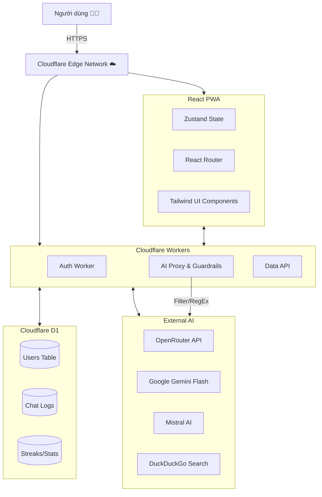
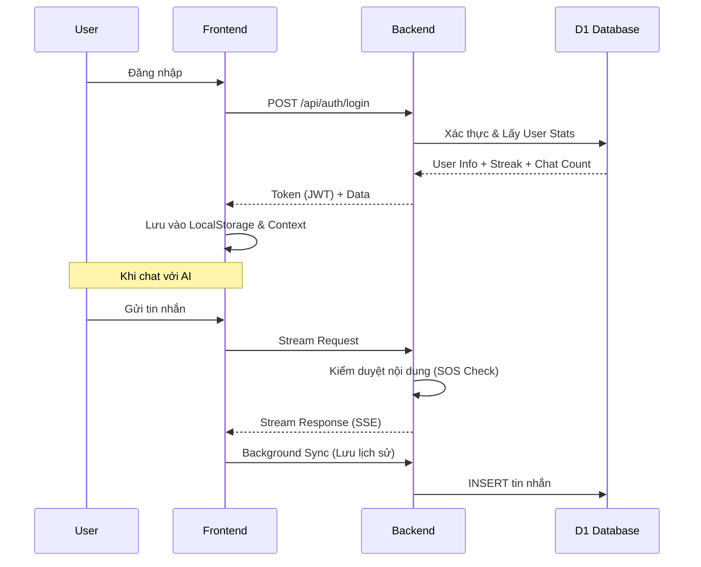

<p align="center">
  
</p>

<h1 align="center">Bạn Đồng Hành (The Companion)</h1>

<p align="center">
  <strong>Nền tảng hỗ trợ sức khỏe tinh thần toàn diện dành cho học sinh Việt Nam 🇻🇳</strong>
</p>

<p align="center">
  
  
  
  
  
</p>

<p align="center">
  <a href="https://bandonghanh.pages.dev">🌐 Live Demo</a> |
  <a href="#-câu-chuyện--sứ-mệnh">📖 Sứ Mệnh</a> |
  <a href="#-tính-năng-chi-tiết">✨ Tính Năng</a> |
  <a href="#-kiến-trúc-hệ-thống">🏗 Kiến Trúc</a> |
  <a href="#-hướng-dẫn-cài-đặt">📦 Cài Đặt</a>
</p>

---

## 📖 Câu chuyện & Sứ mệnh

**"Không ai phải lớn lên một mình."**

Học sinh Việt Nam ngày nay đối mặt với áp lực chưa từng có: điểm số, kỳ vọng gia đình, peer pressure (áp lực đồng trang lứa), và sự bùng nổ của mạng xã hội. Tuy nhiên, rào cản tài chính và tâm lý e ngại phán xét khiến các em khó tiếp cận các dịch vụ tham vấn tâm lý chuyên nghiệp.

**Bạn Đồng Hành** ra đời để lấp đầy khoảng trống đó. Không chỉ là một ứng dụng chat, đây là một **Hệ sinh thái chữa lành số (Digital Healing Ecosystem)**, nơi công nghệ được sử dụng để sưởi ấm trái tim con người.

---

## ✨ Tính năng chi tiết

### 1. 🤖 AI Mentor & Companion (Trợ lý tâm lý ảo)
*   **Trò chuyện tự nhiên:** Khả năng thấu cảm, nhận diện cảm xúc (Emotional Intelligence) và phản hồi như một người bạn thân.
*   **Voice Chat:** Tương tác bằng giọng nói 2 chiều, tạo cảm giác gần gũi như đang gọi điện thoại.
*   **Context-Aware:** AI nhớ ngữ cảnh trò chuyện, tên người dùng, và những câu chuyện cũ.
*   **Safety First (An toàn là trên hết):** Hệ thống SOS đa tầng tự động phát hiện các từ khóa nguy hiểm (tự tử, tự hại) để đưa ra lời khuyên can thiệp và cung cấp số hotline bảo vệ trẻ em (111).
*   **Hỗ trợ học tập:** Hiển thị công thức Toán/Lý/Hóa chuẩn LaTeX đẹp mắt.

### 2. 📊 Real-time Dashboard & Gamification
*   **Streak & Check-in:** Khuyến khích người dùng quay lại mỗi ngày để chăm sóc bản thân.
*   **Thống kê cảm xúc:** Biểu đồ theo dõi tâm trạng hàng tuần, giúp người dùng nhận diện pattern cảm xúc của mình.
*   **Hệ thống XP & Level:** Biến việc tự chăm sóc bản thân thành một hành trình thú vị.

### 3. 🧠 Góc Kiến Thức (Knowledge Hub) - *Mới!*
*   **Thư viện bài viết:** 15+ chủ đề chuyên sâu về tâm lý tuổi dậy thì, hướng nghiệp (Ikigai), an toàn mạng (Cyber Safety), và tài chính cá nhân.
*   **Trải nghiệm đọc:** Giao diện tập trung (Focus Mode), lướt mượt mà trên di động.
*   **Tìm kiếm thông minh:** Tra cứu nhanh các vấn đề đang gặp phải.

### 4. 🧘 Wellness Center (Trung tâm An Yên)
*   **Bài tập thở 4-7-8 & Box Breathing:** Có hoạt hoạ hướng dẫn trực quan giúp giảm stress tức thì.
*   **Lọ Biết Ơn:** Thực hành lòng biết ơn mỗi ngày để nuôi dưỡng tư duy tích cực.
*   **Âm thanh trị liệu:** Tiếng mưa, tiếng rừng, sóng biển, white noise...
*   **Góc riêng tư:** Nơi viết nhật ký bảo mật.

### 5. 🎮 Game Therapy (Trị liệu qua trò chơi)
*   **Bubble Pop:** Xả cơn giận/stress bằng cách đập bong bóng ảo.
*   **Color Match:** Rèn luyện sự tập trung và chánh niệm.
*   **Memory Flip:** Cải thiện trí nhớ ngắn hạn.

---

## 🏗 Kiến trúc Hệ thống

Dự án áp dụng kiến trúc **Serverless** hiện đại, đảm bảo tốc độ cao, chi phí thấp và khả năng mở rộng không giới hạn.

### Sơ đồ tổng quan



### Luồng Authentication & Data Sync



---

## 🛠 Công nghệ sử dụng (Tech Stack)

| Lĩnh vực | Công nghệ chính | Tại sao chọn? |
| :--- | :--- | :--- |
| **Frontend** | React 18, Vite 6 | Hiệu năng cao, DX (Developer Experience) tốt nhất hiện nay. |
| **Language** | JavaScript (ES6+) | Linh hoạt, phổ biến. |
| **Styling** | Tailwind CSS 4 | Phát triển giao diện cực nhanh, bundle size nhỏ. |
| **Animation** | Framer Motion | Tạo các chuyển động mượt mà, cảm xúc (quan trọng cho app trị liệu). |
| **State** | Zustand + Context API | Quản lý state đơn giản, hiệu quả hơn Redux. |
| **Math Render** | KaTeX + Remark/Rehype | Hiển thị công thức Toán học chuẩn chỉ, nhanh hơn MathJax. |
| **Backend** | Cloudflare Workers | Serverless, Edge computing (độ trễ = 0), miễn phí hào phóng. |
| **Database** | Cloudflare D1 (SQLite) | CSDL quan hệ phân tán, truy vấn SQL mạnh mẽ. |
| **AI Model** | Gemini Flash / Mistral | Thông minh, tốc độ phản hồi nhanh, chi phí hợp lý qua OpenRouter. |

---

## 📁 Cấu trúc thư mục

```bash
duancuahocsinh/
├── frontend/                 # React Application
│   ├── src/
│   │   ├── components/       # UI Blocks (Buttons, Cards, Modals...)
│   │   ├── pages/            # Các màn hình chính (Dashboard, Chat...)
│   │   ├── services/         # API Calls (auth, chat, data)
│   │   ├── hooks/            # Custom Logic (useAuth, useAI)
│   │   ├── data/             # Static Content (Articles, Quotes, Stories)
│   │   └── utils/            # Helper functions
│   └── package.json          # Dependencies
│
├── backend/                  # Serverless Backend
│   ├── workers/
│   │   ├── router.js         # API Entry Point & Routing
│   │   ├── auth.js           # Xử lý Đăng ký/Đăng nhập
│   │   ├── ai-proxy.js       # Xử lý Prompt, Streaming, Tool Use
│   │   ├── data-api.js       # Xử lý Check-in, Stats
│   │   └── schema.sql        # Cấu trúc Database
│   ├── wrangler.toml         # Cấu hình Cloudflare
│   └── package.json
│
└── README.md                 # Tài liệu này
```

---

## 📦 Hướng dẫn cài đặt & Triển khai

Để chạy dự án này trên máy local của bạn:

### 1. Chuẩn bị (Prerequisites)
*   Node.js v18 trở lên.
*   Tài khoản Cloudflare (để chạy backend/database).
*   Git.

### 2. Cài đặt Backend (Cloudflare Workers)

```bash
# Clone dự án
git clone https://github.com/LongNgn204/duancuahocsinh.git
cd duancuahocsinh/backend

# Cài đặt thư viện
npm install

# Đăng nhập Cloudflare
npx wrangler login

# Tạo Database D1
npx wrangler d1 create ban_dong_hanh_db

# Chạy lệnh tạo bảng (Migration)
npx wrangler d1 execute ban_dong_hanh_db --local --file=./workers/schema.sql

# Chạy server development
npm run dev
# Server sẽ chạy tại: http://localhost:8787
```

> **Lưu ý:** Cập nhật `wrangler.toml` với `database_id` bạn vừa tạo được.

### 3. Cài đặt Frontend

```bash
cd ../frontend

# Cài đặt thư viện
npm install

# Tạo file môi trường
# (Windows CMD)
echo VITE_API_URL=http://localhost:8787 > .env.local

# Chạy ứng dụng
npm run dev
# App sẽ chạy tại: http://localhost:5173
```

### 4. Deploy lên Production

```bash
# Deploy Backend
cd backend
npm run deploy

# Deploy Frontend
cd frontend
npm run deploy
```

---

## 🤝 Đóng góp (Contributing)

Mọi sự đóng góp đều đáng quý để giúp dự án hoàn thiện hơn!
1.  Fork repo này.
2.  Tạo branch tính năng (`git checkout -b feature/TinhNangMoi`).
3.  Commit thay đổi (`git commit -m 'Thêm tính năng X'`).
4.  Push lên branch (`git push origin feature/TinhNangMoi`).
5.  Tạo Pull Request.

---

## 📄 License

Dự án được phát hành dưới giấy phép **MIT License**.
Copyright © 2024-2026 **Team Bạn Đồng Hành**.

---

<p align="center">
  <i>Được xây dựng với ❤️ và niềm tin vào một thế hệ trẻ khỏe mạnh về tinh thần.</i>
</p>
